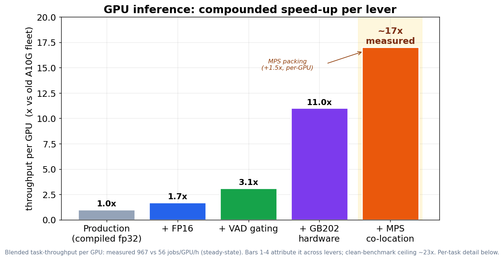
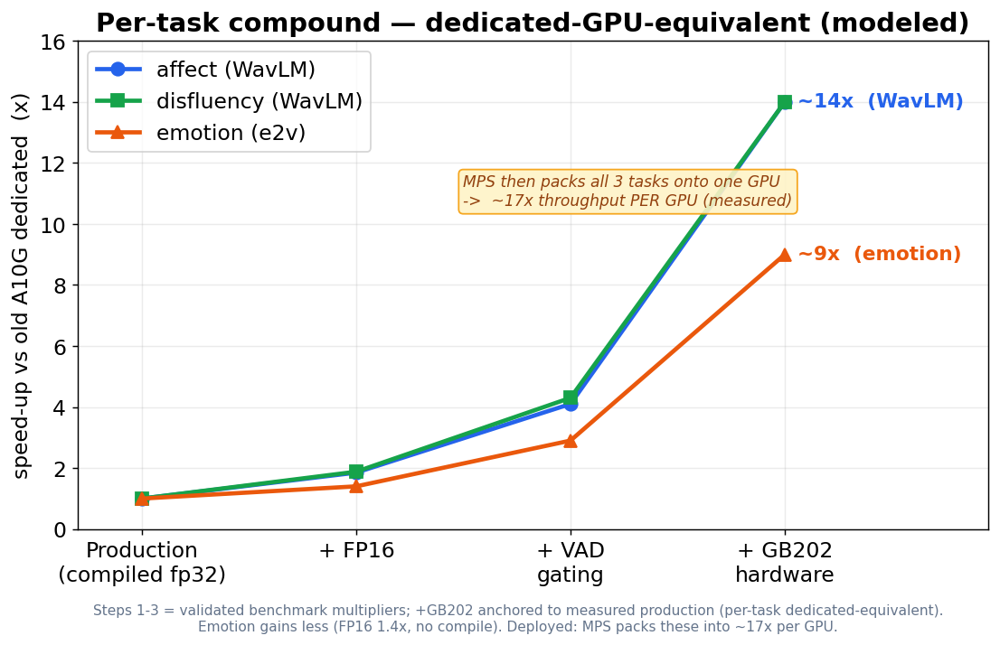
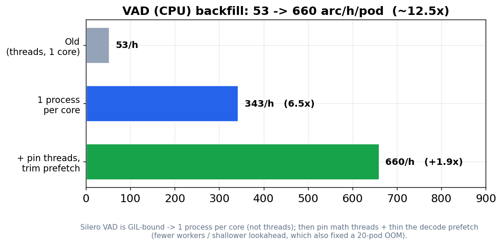
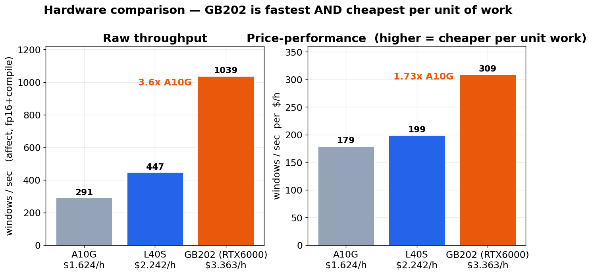
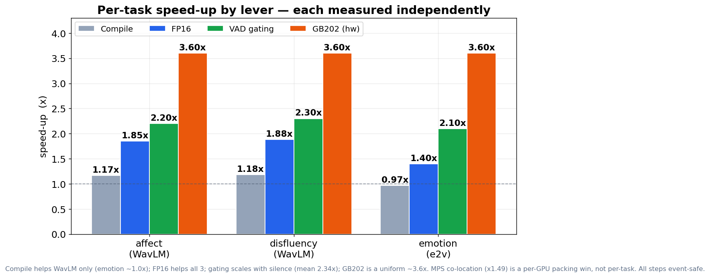

# Acoustic-Event Inference — Optimization Report

**What this covers:** the speed and cost wins from the inference-optimization work (Jun 2026), across
both pipelines we run over the ~590k-archive corpus — the **GPU** path (affect / disfluency / emotion)
and the **VAD** path (CPU). Every number below is measured on real archives with the existing
benchmark harnesses; sources are linked per section.

---

## TL;DR — the headline numbers

| Pipeline | Compound gain | How |
|---|---|---|
| **GPU inference** | **~17× faster per GPU** vs the old A10G fleet (measured) | FP16 + VAD gating + GB202 hardware + MPS co-location |
| **VAD (CPU)** | **~12.5× faster** per pod | 53 → 660 archives/h/pod (process-per-core + thread pinning) |
| **Cost (full corpus)** | **~$60k → ~$7k** (≈8× cheaper) | FP16 + gating + MPS + move to GB202 (best price/perf) |

The **~17×** is the *measured, steady-state* blended throughput per GPU — one GB202 with all levers does
**967 task-jobs/h** vs the old fleet's **~56/GPU/h**. The clean-benchmark compound is **~23×** (the ceiling);
the gap is explained in [Compound gains](#compound-gains). Per task, the heavy WavLM models reach a
**~14× dedicated-equivalent** and emotion **~9×** (see below).

Every GPU lever is **event-safe** — validated by an event-level A/B that requires *zero* events
added, dropped, or relabelled. No accuracy was traded for speed.



Per task (dedicated-GPU-equivalent), the WavLM models compound to **~14×** and emotion to **~9×** — which
blend to the **~11×** `+GB202` bar in the first chart (job-weighted across all three tasks). MPS then packs
all three onto one GPU for the **~17×** per-GPU throughput above:



On the CPU side, the VAD backfill went **~12.5× per pod** (53 → 660 archives/h) — the lever that unlocked
gating coverage for the GPU fleet:



---

## At a glance — every lever

| Lever | Where it applies (granularity) | Gain |
|---|---|---|
| **FP16** (autocast) | per task — all 3 GPU models | **1.85×** WavLM, **1.4×** emotion |
| **torch.compile** | per task — WavLM tasks only | 1.17× (emotion ~0×) |
| **VAD gating** | per archive — skip silent windows | **2.34×** (all 3 tasks, 28% speech) |
| **MPS co-location** | per GPU — 3 tasks share one GPU | **1.49×** (gated) |
| **GB202 hardware** | per GPU — A10G → RTX PRO 6000 | **3.6×** raw, **1.73×** price/perf |
| **VAD multiprocessing** | per CPU pod — N procs / pod | **12.5×** (53→660 arc/h/pod) |

*On the MPS row:* each task actually runs **~1.9–2.3× slower per archive** under co-location (the three
models contend for the GPU's SMs), but because all three run *concurrently* on one GPU the full 3-task
workload still finishes **~1.49× faster** than running them one at a time.

*Why VAD was originally so slow:* Silero VAD is a **GIL-bound** Python loop (~110k tiny per-window calls
per archive), and the knob people reached for — `--vad-prefetch-workers` — is a *thread* pool. N threads
share one GIL, so they just take turns on a single core: "8 workers" but one core busy at ~53 arc/h/pod.
The fix was **processes, not threads** (separate interpreters → separate GILs → separate cores), each
claiming distinct archives — which finally lit up all the cores.

Rejected after measurement (kept the search honest, not the code): **INT8**, **TensorRT**, **fp8**,
**s5cmd/ffmpeg I/O swaps**. See [§ Tried & rejected](#tried--rejected).

---

## Measured in production — before / after

Real fleet rates: the **old** fp32+compile fleet (one task per dedicated GPU, May) vs the **currently
deployed** FP16 + VAD-gated + MPS-co-located fleet on GB202 (Jun 16). Archives per hour, **per GPU**:

| Task | Before — dedicated GPU (fp32+compile) | After — MPS, 3 tasks share 1 GPU | Dedicated-equiv (modeled) |
|---|---|---|---|
| affect | ~32 /h | **~200 /h**  (6.3×) | ~435 /h  (~14×) |
| disfluency | ~40 /h | **~248 /h**  (6.2×) | ~558 /h  (~14×) |
| emotion | ~107 /h | **~515 /h**  (4.8×) | ~960 /h  (~9×) |
| VAD (CPU)† | ~53 /h | **~663 /h**  (**12.5×**) | n/a — CPU, not co-located |

**Net (measured, steady-state):** one GB202 MPS pod completes **~967 task-jobs/h** (199 affect + 247
disfluency + 521 emotion) vs the old fleet's **~56 /GPU/h** (1,576 ÷ 28 GPUs) → **~17× throughput per
GPU**. CURRENT ≈ lifetime on the pod,
so this is steady state, not warm-up. That ~17× already includes MPS as deployed.

*Why ~17× and ~14× don't contradict — they're different units.* ~14× is one WavLM task on a **whole**
GPU; ~17× counts **all three** task-streams a single MPS GPU finishes at once (199 + 247 + 521 = 967/h).
The per-GPU total sits *above* any one task's dedicated rate because MPS runs the three concurrently
(~1.5× packing) — a real gain, not double-counting. (Double-counting would be ~14× **×** 1.49, the
dropped "~21×".)

- **After — MPS**: rate as actually deployed, all three tasks sharing **one** GB202 via MPS. Each task
  gets ~⅓ of the GPU, so its *own* stream is ~5–6× the old dedicated rate — but one GPU now produces all
  three at once (work that previously took three dedicated GPUs), which is why the **per-GPU** total is ~17×.
- **Dedicated-equiv (modeled)**: the MPS rate scaled back up by each task's measured co-tenancy overhead
  (~1.9–2.3×) — what one GB202 would do for that task *alone*. Isolates **FP16 × VAD gating × GB202
  hardware** ≈ **~14× WavLM / ~9× emotion**. *Don't* re-multiply this by the 1.49× MPS factor — that
  double-counts MPS (the earlier "~21×"); ~17× is the honest, fully-measured per-GPU number.
- † The old VAD dashboard pace read **~56,000 arc/h** — a **faulty metric** (it timed only a ~0.05 s
  main-loop slice, not the real VAD work). The real rate was ~53 arc/h/pod; the timestamp-based fix is
  why the "after" VAD number is trustworthy. See [VAD multiprocessing](#vad-multiprocessing-and-the-wrong-rate-count).

---

## Cost

**Per unit of work (measured, solid).** GB202 is the cheapest GPU per 1M windows despite the highest hourly rate:

| GPU | $/h | cost per 1M windows (affect, FP16+compile) |
|---|---|---|
| A10G | 1.624 | $1.55 |
| L40S | 2.242 | $1.39 |
| **GB202 (RTX6000)** | 3.363 | **$0.90** |

GB202 costs 2.07× the A10G per hour but does 3.6× the work, so it's **1.73× cheaper per unit of work** —
the clearest single cost lever we have.



**Full-corpus estimate (≈590k archives, all 3 tasks).** Order-of-magnitude — the GPU-hour base comes from
5 sampled archive durations, so treat the *ratios* as firm and the absolute dollars as indicative:

| Configuration | GPU-hours | Cost |
|---|---|---|
| A10G · compiled fp32 · ungated · dedicated *(old fleet)* | ~37,000 | **~$60,000** |
| A10G · **+ FP16 + VAD gating** (software only) | ~11,000 | ~$18,000 |
| **GB202 · + FP16 + gating + MPS** *(today, measured ~17×/GPU)* | ~2,200 | **~$7,300** |

→ **~8× cheaper** to process the corpus end-to-end (tracks the measured ~17× per-GPU throughput). The
software levers cut it ~3× on any GPU; GB202 (1.73× price/perf) + MPS packing take it the rest of the way.

**VAD (CPU):** ~12.5× fewer pod-hours for the same coverage; the backlog that was a ~2-month job at the old
rate now clears in days and scales linearly with pod count.

---

## Compound gains

**GPU — the lever chain (clean benchmark = the ceiling):**

```
FP16 (1.85×) × VAD gating (2.34×) × GB202 (3.6×) × MPS (1.49×)  ≈  23×   (ceiling)
```

**GPU — measured in production: ~17× per GPU.** One GB202 with all levers completes **967 task-jobs/h**
vs the old fleet's **~56/GPU/h** (steady-state, CURRENT ≈ lifetime). Per task the dedicated-equivalent is
**~14× WavLM / ~9× emotion**; MPS then packs all three onto one GPU for the ~17× per-GPU blend.

### Why ~23× (clean benchmark) → ~17× (measured)

1. **Emotion drags the blend.** It gains only ~9× (FP16 1.4×, no compile, smaller gating win) vs ~14×
   for the WavLM tasks. The corpus runs all three, so the per-GPU blend sits below the WavLM-favorable 23×.
2. **Ragged-batch occupancy.** Real archives are short/variable, so the final batch of each is < the
   static 256 → the GPU runs under-full. The cross-archive micro-batching lever (O3) was scoped but
   **never built** — likely the single biggest shortfall vs the clean single-archive benchmark.
3. **Orchestration overhead** the benchmark doesn't see: lock claiming, manifest scan, heartbeat/timing
   writes, and prefetch/I-O that isn't 100% hidden behind compute.
4. **Gating realized < benchmark.** The 2.34× came from 3 archives at 28% speech; corpus speech-fraction
   likely runs a bit higher (less silence to skip).
5. **`--require-precomputed-vad` friction** (minor): GPU workers skip archives lacking a VAD artifact and
   stat-walk the manifest to find gated work — a small tax, though backfill outpaces GPU so they're not idle.

The 23× was also composed from peak (WavLM-favorable) single-archive multipliers, so it was always the
ceiling, not the expectation. Per-lever contributions:



> Quote the **measured ~17× per GPU** (steady-state). ~23× is the clean-benchmark ceiling; the gap is the
> emotion mix + ragged-batch occupancy + orchestration overhead. The earlier "~21×" multiplied a
> per-task *dedicated-equivalent* by the MPS packing factor — that double-counts MPS, so it's dropped.

**VAD (CPU):** independent of the GPU path.

```
process-per-core (6.5×)  ×  pin threads + trim decode prefetch (1.9×)  ≈  12.5×  per pod
```

---

## The levers — detail

### FP16
Half-precision (autocast) on all three models. **The single highest ROI change** — one default flip,
no new dependencies, and it stacks on the compile we already had.
- **affect 1.85× · disfluency 1.88× · emotion 1.4×** over the compiled-fp32 production baseline.
- **fp16 beats bf16** here (same speed, 5–10× tighter numerics) — these WavLM activations are small
  and normalized, so no overflow and fp16's extra mantissa bits win.
- **Event-safe:** the fp32-vs-fp16 A/B showed 0 events added/dropped, affect labels 100% preserved,
  disfluency timing/scores essentially identical.
- Source: [O2_AUTOCAST_RESULTS.md](baseline_results/O2_AUTOCAST_RESULTS.md), [OPTIMIZATION_FINDINGS.md §1](baseline_results/OPTIMIZATION_FINDINGS.md).

### Compilation
`torch.compile` (static-batch) on the WavLM tasks. Already running in the fleet, so it's *banked*, not
new headroom.
- **WavLM ~1.17×; emotion ~0×** (emotion2vec is at its eager ceiling — compile gives nothing there).
- Modest because WavLM is **GEMM-bound at short windows** (~150–174 tokens; attention is only ~3% of
  FLOPs). This is *why* the real headroom turned out to be precision (FP16), not kernel fusion.
- Caveat: compile needs `pythonX.Y-dev` headers in the image, else it silently falls back to eager.
- Source: [INFERENCE_BASELINE_A10G.md](baseline_results/INFERENCE_BASELINE_A10G.md).

### VAD gating
The archives are **per-speaker stems** that are only **~28% speech**, so over half the GPU compute was
spent on silence. Gating inference to speech windows skips that work.
- **2.34× mean** with all three tasks gated (per-archive, scales with silence: affect 1.6–2.8×,
  disfluency 1.7–2.9×, emotion 1.6–2.6×).
- **Provably event-identical:** the producers already ignore non-speech frames, and the gate keeps a
  *superset* of every frame they read — the A/B confirms **0 drift** on all three tasks.
- Granularity: per archive, per task. Empty/silent stems skip the GPU entirely (free).
- **Dependency:** gating only pays off once archives *have* a VAD artifact — which is exactly what the
  VAD-multiprocessing backfill (below) unlocks. Before it, **0% of GPU completions were gated**.
- Source: [VAD_GATING_IMPLEMENTATION_PLAN.md](VAD_GATING_IMPLEMENTATION_PLAN.md), [IO_AND_PROCESSING_OPTIMIZATION.md §6](IO_AND_PROCESSING_OPTIMIZATION.md).

### GPU efficiency — A10G vs L40S vs GB202 (RTX PRO 6000)
The biggest single lever is the **hardware itself**. Raw throughput on the shipping config (affect, FP16+compile):

| GPU | win/s | raw vs A10G |
|---|---|---|
| A10G | 291 | 1.0× |
| L40S | 447 | 1.5× |
| **GB202 (RTX6000)** | **1039** | **3.6×** |

- The A10G→L40S step barely moves price/perf (its ~1.5× speed ≈ its ~1.38× price premium); GB202's speed
  decisively outpaces its price — see [Cost](#cost) above for the price/performance breakdown.
- Compute-bound on all three GPUs: bigger batches don't help (bs256 is the sweet spot everywhere), so
  the extra VRAM on L40S/GB202 is *not* a speed lever — the architecture (more SMs/clocks) is.
- Source: [L40S_RESULTS.md](baseline_results/L40S_RESULTS.md).

### MPS vs dedicated
Run all three tasks **co-located on one GPU** via CUDA MPS, instead of one task per GPU.
- **1.49× per GPU** (gated) over running the tasks serially/dedicated — i.e. one GPU does the work of ~1.5.
- The fix that got us there: emotion2vec was being **SM-starved** by the two batch-512 WavLM clients
  (MPS only gated 1.32×). Capping the WavLM clients' SM share (40% each, emotion uncapped) + dropping
  WavLM batch 512→256 **de-starved emotion** (its long-archive tail collapsed) and lifted MPS 1.32→1.49×,
  at **no cost** to affect/disfluency.
- Not throttling, not I/O starvation — pure intra-GPU kernel scheduling, fixed by the caps. Keeper config.
- Source: [MPS_OPTIMIZATION.md](MPS_OPTIMIZATION.md).

### VAD multiprocessing (and the "wrong rate count")
VAD runs on CPU and was the bottleneck blocking gating coverage (only ~19.6% of archives had VAD).
- **53 → 660 archives/h/pod (~12.5×)**, in two steps:
  1. **One process per physical core (6.5×).** Silero VAD is a Python loop → **GIL-bound**, so the
     `--vad-prefetch-workers` *threads* all serialized onto one core. Processes (separate GILs) were the fix.
  2. **Pin math threads + trim the decode prefetch (another 1.9×).** torch/BLAS was fanning intra-op
     threads across all cores (N×N contention), and an over-aggressive decode prefetch (`PREFETCH_WORKERS=2`,
     `LOOKAHEAD=4`) pinned a second core per process *and* held several ~250 MB decoded archives in RAM —
     OOM-killing the 20-pod run. Fix: pin each worker to one math thread (`OMP/MKL/OPENBLAS=1`) and thin the
     prefetch to `WORKERS=1`/`LOOKAHEAD=2` (decode ~12 s ≪ VAD ~70 s, so one light prefetch thread suffices).
- **The wrong rate count:** the dashboard `Pace` was latency-derived and reported **~50,000–72,000 arc/h**
  for VAD while the real rate was *tens* per hour — because for VAD `total_sec` only captured a ~0.05 s
  main-loop slice. Now Pace is derived from real completion-timestamp deltas (and sums a host's concurrent
  procs), so the dashboard finally reflects reality.
- Now compute-bound and **scales ~linearly with pods**; the ~474k backlog dropped from ~64 days toward days.
- Source: [VAD_MULTIPROCESSING_ISSUES_AND_OPTIMIZATIONS.md](VAD_MULTIPROCESSING_ISSUES_AND_OPTIMIZATIONS.md) ([ramp chart above](#at-a-glance--every-lever)).

---

## Tried & rejected

Measured and dropped — useful to know the ceiling was actually probed:

| Candidate | Verdict |
|---|---|
| **INT8 PTQ** | Fails the event gate (flips ~18% of affect labels, shifts boundaries up to 4 s) *and* speed-blocked on torch 2.10. |
| **TensorRT** | Correct (fp32) build only 1.19×; TRT-fp16 hits 2.44× but **NaNs**. Doesn't beat PyTorch FP16+compile (2.2×, lossless). |
| **fp8** (L40S/Ada) | torchao path unusable on the stack; hand-rolled gives only **+13% on affect**, nothing on emotion, fails on disfluency. |
| **s5cmd / ffmpeg / torchcodec** | I/O is **not** the bottleneck (pipeline is GPU-bound). Net **slower**, and ffmpeg changes the audio hash. |
| **SDPA attention fusion** | Correct and free, but only **~1.05×** — WavLM is GEMM-bound, attention is ~3% of FLOPs. Kept, not a headline. |

The conclusion across all of them: this workload is **short-window, GEMM-bound, and accuracy-sensitive**,
so **FP16+compile is the precision endpoint** — and the larger wins come from *not computing silence*
(VAD gating), *packing the GPU* (MPS), and *better hardware* (GB202).

---

*Sources: all figures from [optimization_research/](.) and [baseline_results/](baseline_results/).
Plots regenerate with `uv run python optimization_research/report_assets/make_plots.py`.*
